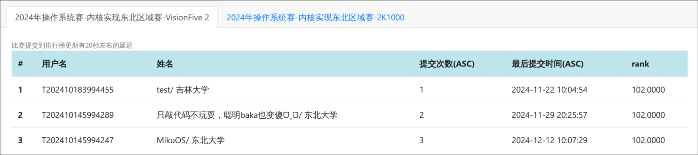

# RISC-V64-MikuOS

RISC-V64 OS written in Rust

## Basic Info

Passed all testcases in 2024.12.12, ranked 3rd.



## Workflows

[](https://github.com/Yttehs-HDX/RISCV64-MikuOS/blob/main/.github/workflows/mirror.yml)

## Docs

- [内核高地址与用户共页](docs/kernel_high_address_and_shared_memory_space.md)
- [无栈协程调度与非阻塞性系统调用](docs/stackless_coroutine_and_non-blocking_syscall.md)

## Setup

```bash
make setup
```

## Usage

### Build

```bash
make build
```

### Run

```bash
make run LOG=<log_level>
# or simply 'make'
```

> log_level options: TRACE, DEBUG, INFO, WARN, ERROR

### Test

> Transplant from [neuq-rcore/rCore](https://github.com/neuq-rcore/rCore)

```bash
make test
```

### Debug

```bash
make debug
```

At the same dir:

```bash
make connect
```

## License

MIT

## I'm thinking Miku, Miku, oo-ee-oo


